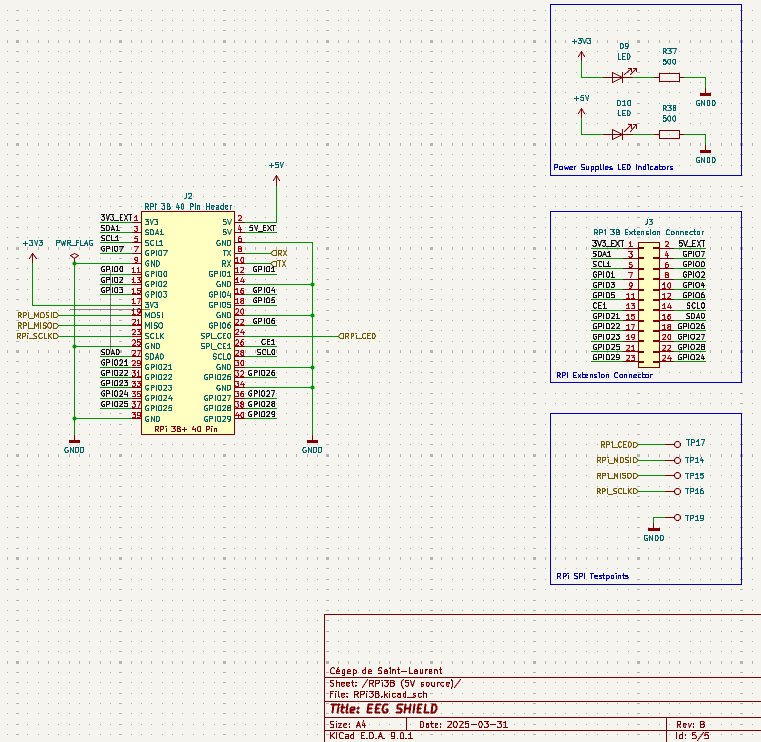
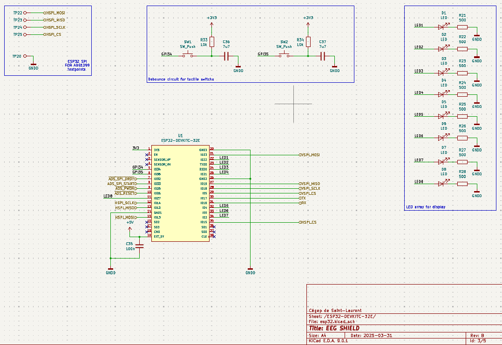
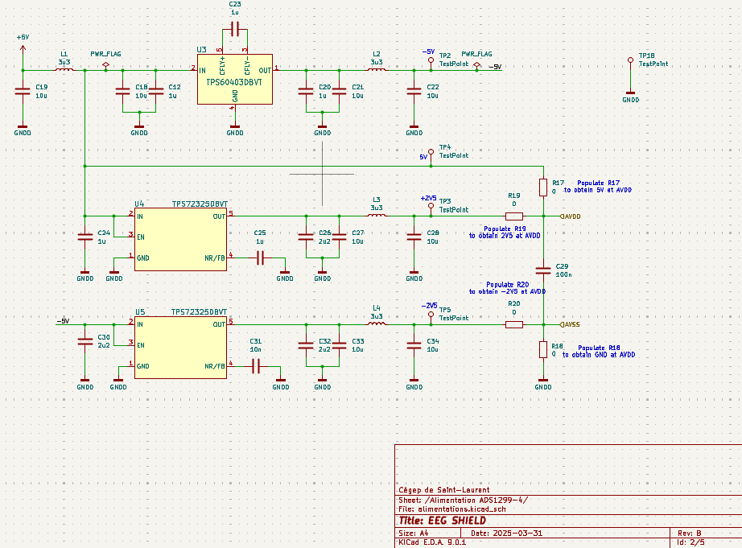
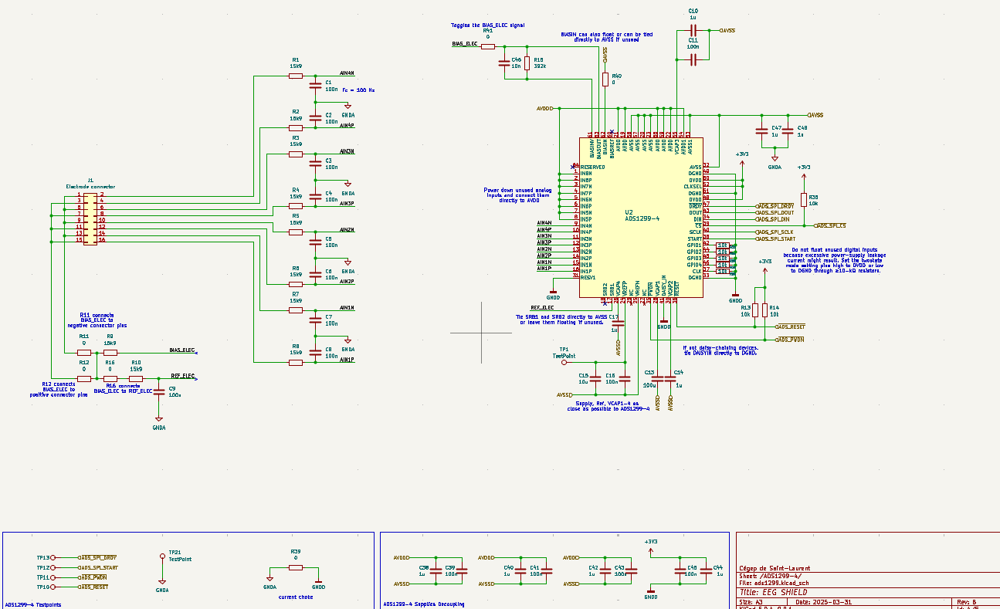
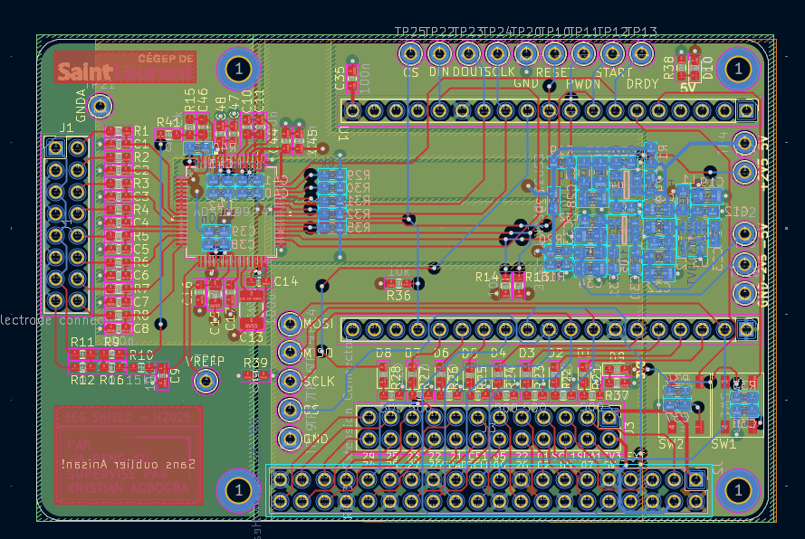
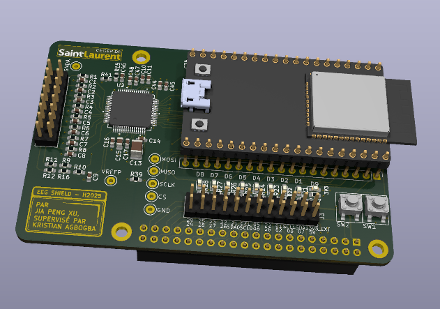
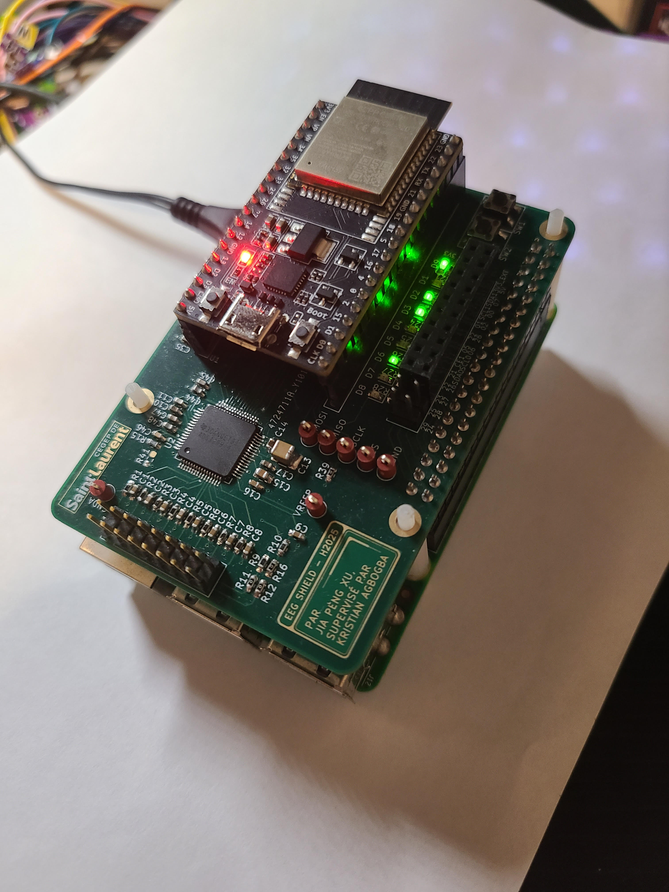

# EEG-SHIELD

Electroencephalography (EEG) acquisition system. Using TI's ADS1299-4 low noise, programmable gain amplifier, 4 channel ADC.
The data is sent to a PC using SPI (raspberry pi in this case) to view measured signals. In order to not lose any bits of data, 
we use a microcontroller (ESP32) to interface with the ADS1299 and relay information to the Raspberry Pi 3B+ (because the RPi is busy interrupting since it is running an OS).

---

## 🧱 Project File Structure

| Folder        | Contents                                      |
|---------------|-----------------------------------------------|
| `KiCAD/`         | Main KiCad project files                     |
| `KiCAD/gerbers`  | KiCad gerber files                           |
| `KiCAD/images`   | Images used in KiCad                         |
| `KiCAD/libraries`| KiCad footprints and symbols                 |
| `PDFs/`          | Useful PDFs for the project                  |
| `images/`        | Images for the Github repository             |
| `source/projet6` | The code                                     |
| `source/projet6/compile-upload-monitor.sh` | Script to build and monitor arduino script  |
| `source/projet6/definitions.h` | #define (register definitions, etc) |
| `source/projet6/functions.h` | Custom functions  |
| `source/projet6/projet6.sh` | Main Arduino sketch, runs the functions in `functions.h`  |

---

## 📷 Images

### Schematics
#### Raspberry Pi 3B+ Circuit

#### ESP32 Circuit

#### Power Circuit
#### it's wrong, please dont send this to the manufacturer, one of the LDOs needs to be swapped for a TPS73225DBVR (and traces modified)

#### ADS1299-4 Circuit

### PCB layout

### 3D render

### End result

---

## 🛠 Tools Used

- KiCad version: 9
- Python 3
- Arduino-cli (cli version of Arduino IDE, less laggy, works with neovim)
  - Look for file `compile-upload-monitor.sh` to see how

---

## 🏗 How to Build / Order

1. Open the `.kicad_pro` project in KiCad 9.
2. Swap that LDO, modify its traces correctly.
3. Generate Gerber files with KiCad's Fabrication tool.

---

## 📦 BOM (Bill of Materials)
### IMPORTANT
- The RPi extension connector is a 24 pin connector, not a 20...
- The parts are ordered in 2x, 3x, in case you lose/break the part or they're bad.
- Need electrodes and abrasive low imped gel
- TPS73225DBVR missing in the BOM (board will short if you use 2 TPS72325DBVR instead of a TPS72325DBVR and a TPS73225DBVR)
- The BOM is missing the ESP32 socket, buy 2 1x19 PinSocket Headers, 2.54 mm pitch per board, or 1x20 and cut the extra off)

|   Qty | Designators                                                                                         | Value                      | Supplier Link                                                                                                                                                                                                                                                        | Footprint                                     |
|------:|:----------------------------------------------------------------------------------------------------|:---------------------------|:---------------------------------------------------------------------------------------------------------------------------------------------------------------------------------------------------------------------------------------------------------------------|:----------------------------------------------|
|     3 | J2                                                                                                  | RPi 3B 40 Pin Socket       | https://www.digikey.ca/en/products/detail/samtec-inc/ESQ-120-44-T-D/7098774                                                                                                                                                                                          | PinSocket_2x20_P2.54mm_Vertical               |
|     3 | J3                                                                                                  | RPi 3B Extension Connector | https://www.digikey.ca/en/products/detail/sullins-connector-solutions/PPTC102LFBN-RC/810216                                                                                                                                                                          | PinHeader_2x12_P2.54mm_Vertical               |
|     2 | U2                                                                                                  | ADS1299-4                  | https://www.digikey.ca/en/products/detail/texas-instruments/ADS1299-4PAGR/6590685                                                                                                                                                                                    | PAG64_TEX                                     |
|    34 | C45,C43,C41,C39,C35,C29,C16,C11,C9,C8,C7,C6,C5,C4,C3,C2,C1                                          | 100n                       | https://www.digikey.ca/en/products/detail/kemet/C0603C104K5RAC7411/3317013                                                                                                                                                                                           | C_0603_1608Metric_Pad1.08x0.95mm_HandSolder   |
|    20 | R6,R10,R9,R8,R7,R5,R4,R3,R2,R1                                                                      | 15k9                       | https://www.digikey.ca/en/products/detail/yageo/RC0603FR-0715K8L/726957                                                                                                                                                                                              | R_0603_1608Metric_Pad0.98x0.95mm_HandSolder   |
|     6 | U5,U4                                                                                               | TPS72325DBVT               | https://www.digikey.ca/en/products/detail/texas-instruments/TPS72325DBVR/1672727                                                                                                                                                                                     | DBV0005A                                      |
|     3 | U3                                                                                                  | TPS60403DBVT               | https://www.digikey.ca/en/products/detail/texas-instruments/TPS60403DBVT/484639                                                                                                                                                                                      | DBV5                                          |
|     2 | U1                                                                                                  | ESP32-DEVKITC-32E          | https://www.digikey.ca/en/products/detail/espressif-systems/ESP32-DEVKITC-32E/12091810?s=N4IgTCBcDaIKYGcAOBmMBaAJnAbgawEsAXAY3TThAF0BfIA                                                                                                                             | ESP32-DEVKITC-32E                             |
|    21 | TP25,TP24,TP23,TP22,TP21,TP20,TP19,TP18,TP17,TP16,TP15,TP14,TP13,TP12,TP11,TP10,TP5,TP4,TP3,TP2,TP1 | TestPoint                  | https://www.digikey.ca/en/products/detail/keystone-electronics/5000/255326                                                                                                                                                                                           | TestPoint_Keystone_5000-5004_Miniature        |
|     4 | SW2,SW1                                                                                             | SW_Push                    | https://www.digikey.ca/en/products/detail/c-k/PTS647SK38SMTR2-LFS/9649862                                                                                                                                                                                            | PTS647SK38SMTR2                               |
|    36 | R41,R40,R20,R19,R18,R17,R16,R12,R11                                                                 | 0                          | https://www.digikey.ca/en/products/detail/yageo/RC0603JR-070RL/726675                                                                                                                                                                                                | R_0603_1608Metric_Pad0.98x0.95mm_HandSolder   |
|    20 | R38,R37,R28,R27,R26,R25,R24,R23,R22,R21                                                             | 500                        | https://www.digikey.ca/en/products/detail/vishay-dale/RCS0603510RFKEA/5868452                                                                                                                                                                                        | R_0603_1608Metric_Pad0.98x0.95mm_HandSolder   |
|    20 | R36,R35,R34,R33,R32,R31,R30,R29,R14,R13                                                             | 10k                        | https://www.digikey.ca/en/products/detail/yageo/RC0603FR-0710KL/726880                                                                                                                                                                                               | R_0603_1608Metric_Pad0.98x0.95mm_HandSolder   |
|     3 | R15                                                                                                 | 392k                       | https://www.digikey.ca/en/products/detail/stackpole-electronics-inc/RMCF0603FT392K/1760716                                                                                                                                                                           | R_0603_1608Metric_Pad0.98x0.95mm_HandSolder   |
|     8 | L4,L3,L2,L1                                                                                         | 3u3                        | https://www.digikey.ca/en/products/detail/tdk-corporation/MLZ2012A3R3WT000/2465152                                                                                                                                                                                   | L_0805_2012Metric_Pad1.05x1.20mm_HandSolder   |
|     3 | J1                                                                                                  | Electrode connector        | https://www.digikey.ca/en/products/detail/amphenol-cs-fci/10129381-916001BLF/7916090                                                                                                                                                                                 | PinHeader_2x08_P2.54mm_Vertical               |
|    30 | D10,D9,D8,D7,D6,D5,D4,D3,D2,D1                                                                      | LED                        | https://www.digikey.ca/en/products/detail/liteon/LTST-C190GKT/269230                                                                                                                                                                                                 | LED_0603_1608Metric_Pad1.05x0.95mm_HandSolder |
|    28 | C48,C47,C44,C42,C40,C38,C25,C24,C23,C20,C17,C14,C12,C10                                             | 1u                         | https://www.digikey.ca/en/products/detail/taiyo-yuden/TMK107BJ105KA-T/930600                                                                                                                                                                                         | C_0603_1608Metric_Pad1.08x0.95mm_HandSolder   |
|     6 | C46,C31                                                                                             | 10n                        | https://www.digikey.ca/en/products/detail/kemet/C0603C103K5RACTU/411090                                                                                                                                                                                              | C_0603_1608Metric_Pad1.08x0.95mm_HandSolder   |
|     6 | C37,C36                                                                                             | 7u7                        | https://www.digikey.ca/en/products/detail/samsung-electro-mechanics/CL10A475KO8NNNC/3887442                                                                                                                                                                          | C_0603_1608Metric_Pad1.08x0.95mm_HandSolder   |
|    18 | C34,C33,C28,C27,C22,C21,C19,C18,C15                                                                 | 10u                        | https://www.digikey.ca/en/products/detail/samsung-electro-mechanics/CL21A106KPFNNNE/3886710                                                                                                                                                                          | C_0805_2012Metric_Pad1.18x1.45mm_HandSolder   |
|    12 | C32,C30,C26                                                                                         | 2u2                        | https://www.digikey.ca/en/products/detail/samsung-electro-mechanics/CL10A225KQ8NNWC/3887544                                                                                                                                                                          | C_0603_1608Metric_Pad1.08x0.95mm_HandSolder   |
|     3 | C13                                                                                                 | 100u                       | https://www.digikey.ca/en/products/detail/murata-electronics/GRM32ER61A107ME20L/4905633                                                                                                                                                                              | C_1210_3225Metric_Pad1.33x2.70mm_HandSolder   |
|     1 | nan                                                                                                 | Ten20 EEG Conductive Gel   | https://www.redskymedical.ca/products/ten-20-conductive?_pos=1&_sid=2f7834543&_ss=r                                                                                                                                                                                  | nan                                           |
|     1 | nan                                                                                                 | Gold cup electrodes        | https://shop.openbci.com/products/openbci-gold-cup-electrodes                                                                                                                                                                                                        | nan                                           |

---

## ✍️ Author & Contributions

- Project by Jia Peng Xu
- Supervised by Kristian M. Agbogba

---
## Future considerations
- Use something else than an ESP32, they're running FreeRTOS under the hood! Did not know this at the time. Will use something like an STM32 or a Atmel micro next time.
